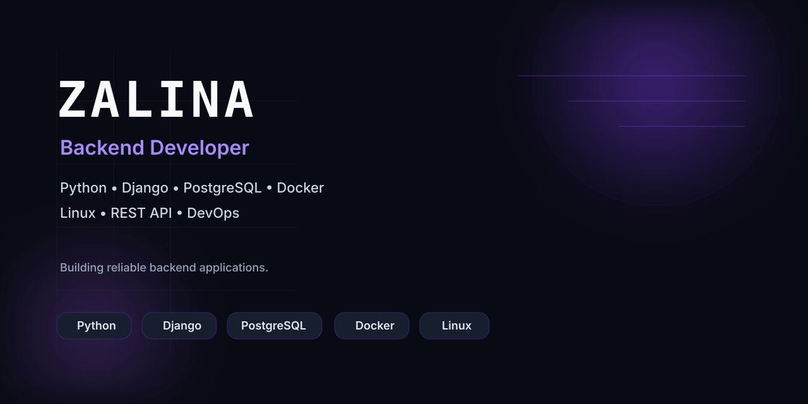

# 👋 Привет, я Залина

### Backend-разработчик • Python • Django • PostgreSQL

Создаю надёжные backend‑приложения, проектирую REST API и изучаю DevOps.

---

# 👩‍💻 Обо мне

Я студентка направления **«Информационные системы и программирование»** и Backend‑разработчик.

Люблю проектировать архитектуру приложений, создавать REST API, работать с PostgreSQL и постепенно углубляюсь в Linux, Docker и CI/CD.

---

# 🚀 Избранные проекты

| Проект | Описание |
|--------|----------|
| 🤖 **VacBot** | AI‑платформа для поиска работы, Telegram‑бот, парсер вакансий, Docker, GitHub Actions, PostgreSQL. |
| 💻 **Portfolio** | Интерактивное терминальное портфолио на React + Vite. |
| 💰 **Personal Finance Client‑Server** | Клиент‑серверное приложение для учёта личных финансов. |
| 🍲 **Recipe App** | Backend на Django REST Framework для работы с рецептами. |

---

# 🛠 Технологии

### Backend

### Базы данных

### DevOps

### Frontend

### Инструменты

---

# 🌱 Сейчас изучаю

- Linux
- Docker
- GitHub Actions
- CI/CD
- Nginx
- System Design

---

# 📊 GitHub

---

# 📫 Контакты

